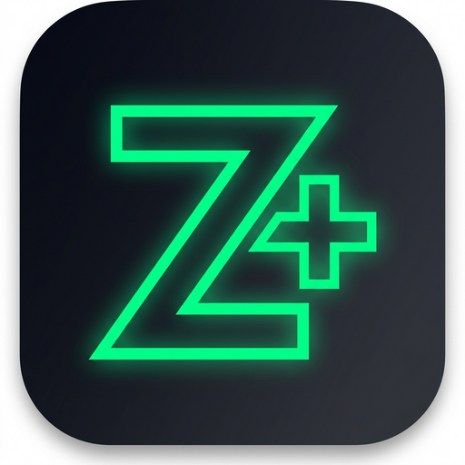

# ZBIZ+ — Plataforma Empresarial Modular e SaaS Multissetorial

> **ZBIZ+**: A Solução ERP & POS Inteligente concebida para o mercado de **Moçambique**, com suporte nativo a Farmácias (ANARME), Restauração com KDS/Mesas, Retalho Geral e Prestação de Serviços.



[](./docs/20_CHANGELOG.md)
[](https://www.php.net)
[](https://laravel.com)
[](docker-compose.yml)
[](#-suporte--contacto)

---

## 🌟 Visão Geral

O **ZBIZ+** é uma evolução de nível empresarial do ReproSys, arquitetado como um Monólito Modular Multi-Tenant com isolamento estrito de dados por empresa e filial. Desenvolvido para resolver os desafios reais do comércio e serviços em Moçambique: conectividade instável, necessidade de conformidade regulatória (ANARME), gestão de múltiplos balcões/filiais e reconciliação financeira (M-Pesa e e-Mola).

### 🧩 Módulos Verticais Especializados:
* **💊 ZBIZ Farmácia:** Rastreabilidade estrita de Lotes, Validades (alertas dinâmicos de 30/60/90 dias), algoritmo FEFO (*First Expire, First Out*), dosagem, substância ativa e relatórios de psicotrópicos em conformidade com as diretrizes da **ANARME**.
* **🍽️ ZBIZ Restauração:** Gestão de mesas em tempo real, visualização de ocupação, comanda eletrónica e painel de cozinha (KDS - Kitchen Display System).
* **🛒 ZBIZ Retalho & Supermercado:** Frente de Caixa (POS 2.0) de alta velocidade, suporte a leitores de código de barras, atalhos de teclado, inventário por filial e transferências entre lojas.
* **🖨️ ZBIZ Serviços & Reprografia:** Gestão de ordens de serviço, insumos de produção vinculados, adiantamentos/sinal e faturação modular.
* **💳 Pagamentos Nacionais:** Suporte a pagamentos em Dinheiro, M-Pesa (C2B STK Push), e-Mola, Cartão POS (POS físico) e Vendas a Crédito com gestão de amortizações.
* **🏢 SaaS & Centro de Controlo do Proprietário:** Emissão de chaves de licença seriais offline (certificados PDF oficiais), upgrade instantâneo de planos e modo suporte (*impersonate*) com 1 clique.

---

## 🚀 Opções de Instalação & Onboarding

O ZBIZ+ oferece 4 métodos de arranque adaptados a cada perfil de operação:

### 🖥️ Método 1: Onboarding Rápido em Modo Kiosk / App Nativo (Recomendado para Clientes)

Para postos de venda em farmácias e lojas, o operador não deve navegar com barras de browser, abas ou risco de fechar acidentalmente. Os instaladores configuram o sistema como uma **App Nativa Kiosk** com atalho no ambiente de trabalho e suporte a **impressão térmica silenciosa**.

#### No Windows:
1. Faça duplo clique no ficheiro:
   ```cmd
   install-windows.bat
   ```
2. O instalador detectará o Microsoft Edge ou Google Chrome e perguntará:
   - **URL do Servidor:** Pressione `ENTER` para usar o servidor Nuvem (`http://146.235.224.99/zbiz_plus`) ou digite o IP local.
   - **Formato:** Modo App (Janela limpa nativa) ou Modo Kiosk Total (Tela cheia travada).
   - **Inicialização Automática:** Opção de abrir o ZBIZ+ assim que o computador ligar.
3. Um atalho **"ZBIZ+ Terminal POS"** com o ícone oficial será gerado na Área de Trabalho.

#### No Linux (Ubuntu, Mint, Debian, etc.):
1. Torne o script executável e execute:
   ```bash
   chmod +x install-linux.sh
   ./install-linux.sh
   ```
2. Selecione a opção `[1]` para configurar o Terminal Kiosk.
3. O lançador `.desktop` será integrado ao seu menu de aplicativos e à sua Área de Trabalho com permissões confiadas.

---

### 🐳 Método 2: Instalação via Docker (Orquestração Completa)

Ideal para servidores locais ou ambientes de desenvolvimento que exijam zero configuração manual de dependências.

#### Pré-requisitos:
* Docker e Docker Compose instalados.

#### Passos:
```bash
# 1. Clonar o repositório
git clone https://github.com/filipeive/ZBIZ_PLUS.git
cd ZBIZ_PLUS

# 2. Iniciar a stack (App ZBIZ+ PHP 8.3 + Banco MySQL 8.0)
docker compose up -d

# 3. Verificar o estado dos containers
docker compose ps
```

Aceda à aplicação no seu navegador: **`http://localhost:8000`**

O container executa automaticamente:
- Verificação de saúde do MySQL
- Migração automática das tabelas (`php artisan migrate --force`)
- Geração de chave de segurança (`APP_KEY`) caso não exista
- Configuração de permissões nas pastas `storage` e `bootstrap/cache`
- Criação dos links de storage

Para parar os serviços:
```bash
docker compose down
```

---

### ⚙️ Método 3: Instalação Manual (Servidor Tradicional PHP 8.3 + MySQL)

#### Pré-requisitos:
* PHP 8.3 com extensões: `bcmath`, `ctype`, `fileinfo`, `json`, `mbstring`, `openssl`, `pdo_mysql`, `tokenizer`, `xml`, `gd`, `zip`, `intl`
* Composer 2.x
* MySQL 8.0 ou MariaDB 10.4+
* Servidor Web (Nginx ou Apache com `mod_rewrite`)

#### Execução:
```bash
# 1. Clonar o repositório
git clone https://github.com/filipeive/ZBIZ_PLUS.git
cd ZBIZ_PLUS

# 2. Instalar dependências PHP
composer install --optimize-autoloader --no-dev

# 3. Configurar ficheiro de ambiente
cp .env.example .env
php artisan key:generate

# 4. Ajustar variáveis no .env
# DB_CONNECTION=mysql
# DB_HOST=127.0.0.1
# DB_DATABASE=zbizplus_db
# DB_USERNAME=fdsms
# DB_PASSWORD=fdsadmin

# 5. Executar migrações e dados base
php artisan migrate --force
php artisan db:seed --class=PlanSeeder --force
php artisan db:seed --class=OperationalMultiBranchSeeder --force

# 6. Criar link simbólico para storage
php artisan storage:link

# 7. Ajustar permissões
sudo chown -R www-data:www-data storage bootstrap/cache
sudo chmod -R 775 storage bootstrap/cache
```

---

### 🌐 Método 4: Deploy em Produção via Script

Para atualizar o servidor em nuvem (`146.235.224.99`) de forma atômica e segura:

```bash
# 1. Enviar os commits locais para o GitHub
git push origin main

# 2. Executar o script de deploy automatizado
./deploy.sh
```

O `deploy.sh` realiza no servidor:
- Sincronização segura via chave SSH (`git fetch & reset --hard`)
- Instalação otimizada de pacotes (`composer install --no-dev`)
- Execução de novas migrações de base de dados
- Limpeza e regeração de caches de produção (`config:cache`, `route:cache`, `view:cache`)
- Ajuste de permissões de ficheiros
- Recarregamento sem interrupção do PHP 8.3-FPM e Nginx

---

## 🔑 Credenciais Padrão do Sistema (Ambiente de Testes)

| Papel / Perfil | E-mail de Acesso | Palavra-passe | Empresa / Âmbito |
| :--- | :--- | :--- | :--- |
| **Super Administrador SaaS** | `superadmin@zbizpos.com` | `password123` | Plataforma Global / Centro de Controlo |
| **Farmácia Central (Admin)** | `admin@farmaciacentral.co.mz` | `password123` | Farmácia Muzinga (ANARME / Lotes) |
| **Farmácia Central (Caixa)** | `caixa@farmaciacentral.co.mz` | `password123` | Frente de Caixa Farmácia |
| **Retalho Zambézia (Admin)** | `admin@superzambezia.co.mz` | `password123` | Supermercado Zambézia |
| **FDS Multiservices (Admin)** | `admin@fdsmultiservices.co.mz`| `password123` | Reprografia, Brindes & Serviços |

---

## 📚 Documentação de Arquitetura & Engenharia

A documentação detalhada de governança e regras de negócio está na pasta [`docs/`](./docs):

* [`00_SYSTEM_STATUS_AND_ARCHITECTURE_2026.md`](./docs/00_SYSTEM_STATUS_AND_ARCHITECTURE_2026.md) — Relatório de Estado do Sistema e Arquitetura Completa
* [`03_ROADMAP.md`](./docs/03_ROADMAP.md) — Cronograma de Desenvolvimento (Fases 1 a 10 Concluídas)
* [`06_DATABASE_SCHEMA.md`](./docs/06_DATABASE_SCHEMA.md) — Dicionário Oficial de Base de Dados (30+ Tabelas e Relacionamentos)
* [`07_VERTICAL_MODULES.md`](./docs/07_VERTICAL_MODULES.md) — Especificação dos Módulos Farmácia, Restauração, Retalho e Serviços
* [`09_PHARMACY_REGULATORY_GUIDE.md`](./docs/09_PHARMACY_REGULATORY_GUIDE.md) — Diretrizes ANARME, Lotes, FEFO e Psicotrópicos
* [`13_OWNER_CONTROL_CENTER_AND_OFFLINE_LICENSES.md`](./docs/13_OWNER_CONTROL_CENTER_AND_OFFLINE_LICENSES.md) — Centro de Licenças e Suporte Impersonate
* [`APRESENTACAO_CLIENTE_FARMACIA.md`](./docs/APRESENTACAO_CLIENTE_FARMACIA.md) — Apresentação Comercial para Proprietários de Farmácias
* [`20_CHANGELOG.md`](./docs/20_CHANGELOG.md) — Registo Histórico de Versões

---

## 🛡️ Suporte & Contacto

O **ZBIZ+** é desenvolvido e mantido com rigor de engenharia por:

* **Desenvolvido por:** **Fdsmultiservices**
* **WhatsApp / Linha Direta:** [(+258) 86 213 4230](https://wa.me/258862134230)
* **Correio Eletrónico:** [fdsmultiservices@gmail.com](mailto:fdsmultiservices@gmail.com)
* **Localização:** Quelimane / Maputo — Moçambique

---

*ZBIZ+ · Enterprise Cloud & POS Suite v1.0.19 · Desenvolvido por Fdsmultiservices*
